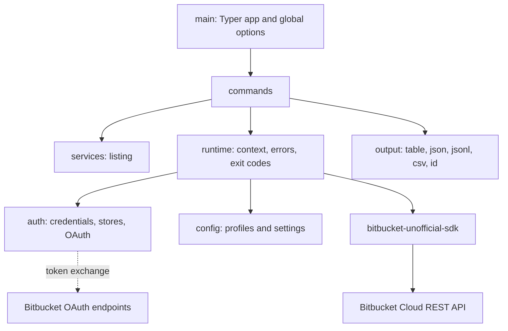

# Bitbucket Unofficial CLI

[](https://github.com/gajaguar/bitbucket-cli/actions/workflows/ci.yml)
[](https://pypi.org/project/bitbucket-unofficial-cli/)
[](https://github.com/gajaguar/bitbucket-cli/blob/main/pyproject.toml)
[](https://github.com/gajaguar/bitbucket-cli/blob/main/LICENSE)
[](https://github.com/gajaguar/bitbucket-cli)

> **Unofficial.** This project is not affiliated with, endorsed by, or
> supported by Atlassian. "Bitbucket" is a trademark of Atlassian. Use at your
> own risk against the
> [Bitbucket Cloud REST API](https://developer.atlassian.com/cloud/bitbucket/rest/intro/).

Unofficial command-line interface for Bitbucket Cloud built on
[`bitbucket-unofficial-sdk`](https://pypi.org/project/bitbucket-unofficial-sdk/).
It logs in with an Atlassian API token, an access token or an OAuth 2
consumer, and prints results as a table, JSON, JSON Lines, CSV or bare
identifiers.

`1.0.0` covers everything the SDK offers, and freezes the exit codes, the JSON
output, the command surface and the settings keys; see
[`docs/roadmap.md`](docs/roadmap.md).

## Table of contents

- [About](#about)
- [Key features](#key-features)
- [Architecture](#architecture)
- [Getting started](#getting-started)
- [Usage](#usage)
- [Configuration](#configuration)
- [Development](#development)
- [Roadmap](#roadmap)
- [Contributing](#contributing)
- [Security](#security)
- [License](#license)

## About

The CLI is a thin layer over the SDK: commands parse options, call one SDK
method, and render the model it returns. It never builds a URL or sends a
request by hand, except for the OAuth token exchange, which the SDK leaves to
the application.

## Key features

- **Three ways to authenticate.** An Atlassian API token with your email, a
  repository, project or workspace access token, or an OAuth 2 consumer
  (authorization code or client credentials) that renews its own token.
- **Safe storage.** Credentials go to the system keyring. A `0600` file is an
  explicit opt-in, and no secret is ever accepted as a command-line argument.
- **Scriptable output.** `table` on a terminal, JSON when piped, plus `jsonl`,
  `csv` and `id`. Data goes to stdout; messages and errors go to stderr.
- **Stable exit codes.** Each failure class has its own code, so a script can
  tell a missing credential from a missing repository.
- **Profiles.** Keep several accounts and select one with `--profile`.

## Architecture



Layers point downward only. See
[`docs/architecture/layering.md`](docs/architecture/layering.md).

## Getting started

Install the command from PyPI:

```bash
uv tool install bitbucket-unofficial-cli
# or
pipx install bitbucket-unofficial-cli
```

From a checkout, `make install` syncs the dependencies and registers the
`bitbucket` command.

Log in, pick a workspace and look around:

```bash
bitbucket auth login                 # Atlassian email and API token
bitbucket workspace list
bitbucket workspace use my-workspace
bitbucket repo list
```

## Usage

### Authentication

| Command                                             | What it stores                                                       |
| --------------------------------------------------- | -------------------------------------------------------------------- |
| `bitbucket auth login` (or `--api-token`)           | Your Atlassian email and an [API token][api-token]                   |
| `bitbucket auth login --access-token`               | A repository, project or workspace access token, or any bearer token |
| `bitbucket auth login --oauth`                      | An OAuth consumer's tokens, through your browser                     |
| `bitbucket auth login --oauth --client-credentials` | An OAuth consumer's tokens, with no browser                          |
| `bitbucket auth status`                             | Nothing: shows the active credential and the user it belongs to      |
| `bitbucket auth refresh`                            | Nothing: renews the stored OAuth token now                           |
| `bitbucket auth token`                              | Nothing: prints the API token or bearer token, for scripts           |
| `bitbucket auth logout`                             | Nothing: removes the stored credential and profile                   |

Secrets come from a hidden prompt, or from standard input with
`--with-token`. For OAuth, set `BITBUCKET_OAUTH_CLIENT_SECRET` to skip the
prompt. Setting up a consumer is in
[`docs/auth/oauth-consumer.md`](docs/auth/oauth-consumer.md).

In CI, skip `auth login` and set `ATLASSIAN_USER_EMAIL` with
`ATLASSIAN_API_TOKEN`, or `BITBUCKET_ACCESS_TOKEN`. The environment wins over
anything stored.

### Commands

| Command                          | Does                                                                        |
| -------------------------------- | --------------------------------------------------------------------------- |
| `bitbucket user me`              | Show the user the credential belongs to                                     |
| `bitbucket workspace list`       | List the workspaces the credential can access                               |
| `bitbucket workspace get [SLUG]` | Show a workspace; defaults to the selected one                              |
| `bitbucket workspace use SLUG`   | Save the workspace in the active profile                                    |
| `bitbucket repo list`            | List repositories (`--query`, `--sort`, `--limit`)                          |
| `bitbucket repo get SLUG`        | Show one repository                                                         |
| `bitbucket repo create SLUG`     | Create a repository (`repo update`, `delete`, `fork`, `forks`, `watchers`)  |
| `bitbucket project list`         | Projects (`get`, `create`, `update`, `delete`)                              |
| `bitbucket member list`          | Workspace members (`get`)                                                   |
| `bitbucket permission list`      | Workspace and repository permissions (`mine`)                               |
| `bitbucket webhook list`         | Webhooks of a repository or workspace (`get`, `create`, `update`, `delete`) |
| `bitbucket hook-event list TYPE` | Events a webhook can subscribe to (`types`)                                 |
| `bitbucket workspace gpg-key`    | Print the workspace GPG public key                                          |
| `bitbucket config path`          | Print the settings file location                                            |
| `bitbucket config list`          | List profiles                                                               |
| `bitbucket config use NAME`      | Set the default profile                                                     |

Bitbucket pages results by cursor, so list commands take `--limit N` to stop
early, or `--cursor URL` to fetch one page; the cursor of the next page is
printed to stderr.

### Global options

Global options go before the command: `bitbucket -o json repo list`.

| Option              | Environment           | Meaning                                 |
| ------------------- | --------------------- | --------------------------------------- |
| `-p`, `--profile`   | `BITBUCKET_PROFILE`   | Configuration profile to use            |
| `-w`, `--workspace` | `BITBUCKET_WORKSPACE` | Workspace slug; overrides the profile   |
| `-o`, `--output`    | `BITBUCKET_OUTPUT`    | `table`, `json`, `jsonl`, `csv` or `id` |
| `-v`, `--verbose`   |                       | Print each HTTP request to stderr       |
| `--version`         |                       | Show the version and exit               |

Without `--output`, a terminal gets a table and a pipe gets JSON.

### Exit codes

| Code | Meaning                                    |
| ---- | ------------------------------------------ |
| 0    | Success                                    |
| 1    | Unspecified failure                        |
| 2    | Usage error                                |
| 3    | Configuration: no credential, no workspace |
| 4    | Authentication failed                      |
| 5    | Forbidden                                  |
| 6    | Not found                                  |
| 7    | Validation or conflict                     |
| 8    | Rate limited                               |
| 9    | Bitbucket or the network is unavailable    |

## Configuration

| Variable                        | Meaning                                                    |
| ------------------------------- | ---------------------------------------------------------- |
| `ATLASSIAN_USER_EMAIL`          | Account email, with `ATLASSIAN_API_TOKEN`                  |
| `ATLASSIAN_API_TOKEN`           | Atlassian API token                                        |
| `BITBUCKET_ACCESS_TOKEN`        | Access token sent as a bearer; not combined with the above |
| `BITBUCKET_OAUTH_CLIENT_ID`     | OAuth consumer key for `auth login --oauth`                |
| `BITBUCKET_OAUTH_CLIENT_SECRET` | OAuth consumer secret for `auth login --oauth`             |
| `BITBUCKET_WORKSPACE`           | Default workspace slug                                     |
| `BITBUCKET_PROFILE`             | Default profile                                            |
| `BITBUCKET_OUTPUT`              | Default output format                                      |
| `BITBUCKET_CLI_CONFIG_DIR`      | Where `config.toml` and `credentials.toml` live            |

## Development

```bash
make install   # dependencies, the `bitbucket` command and the git hooks
make check     # lint, types, spelling, commit messages
make test      # the test suite, with a 90% coverage floor
make help      # every target
```

The `live` tests hit the real API and are skipped unless
`ATLASSIAN_USER_EMAIL`, `ATLASSIAN_API_TOKEN` and `BITBUCKET_WORKSPACE` are
set; run them with `uv run pytest -m live`.

## Roadmap

- [x] `0.1.0` Foundation: authentication, configuration, output, `user me`,
  workspace and repository read commands
- [x] `0.2.0` Repositories, projects, members, webhooks
- [x] `0.3.0` Pull requests
- [x] `0.4.0` Branches, tags, commits, source, statuses, reports, downloads
- [x] `0.5.0` Branch restrictions, branching model, reviewers, permissions
- [x] `0.6.0` Pipelines
- [x] `0.7.0` Environments and deployments
- [x] `0.8.0` Keys, emails, search
- [x] `0.9.0` Snippets
- [x] `1.0.0` Every SDK capability, with the contracts frozen

The detail, and what `1.0.0` freezes, is in [`docs/roadmap.md`](docs/roadmap.md).
[`docs/coverage.md`](docs/coverage.md) maps each SDK capability to its command.

## Contributing

See [CONTRIBUTING.md](CONTRIBUTING.md).

## Security

Report a vulnerability privately to <dev@gajaguar.com> instead of opening a
public issue.

## License

See [LICENSE](LICENSE).

[api-token]: https://support.atlassian.com/bitbucket-cloud/docs/create-an-api-token/
